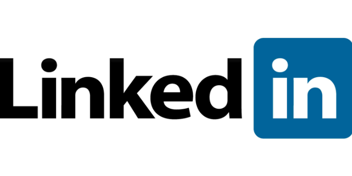

# Dicas

    

## Conteúdos
- [Mercado de Trabalho](#mercado-de-trabalho)
    - [Como conseguir oportunidades](#como-conseguir-oportunidades)
    - [como se destacar](#como-se-destacar)
    - [Como estruturar o seu currículo](#como-estruturar-o-seu-currículo)
    - [Como se preparar para um processo seletivo](#como-se-preparar-para-um-processo-seletivo)
    - [Continue a nadar](#continue-a-nadar)
## Mercado de Trabalho

Nos últimos anos tivemos uma crescente no número de pessoas interessadas no mercado de trabalho de **dados** e **algorítmos de Inteligência Artificial**. Com os últimos avanços na área e o aumento constante da demanda por profissionais qualificados, é necessário seguir alguns **conselhos** pra sair na frente dos outros nessa área tão competitiva. É por esse motivo que fizemos essa seção no nosso repositório!

### Como conseguir oportunidades

Todos sabemos que a área de tecnologia é uma das áreas do mercado de trabalho com maior rotatividade. Novas vagas abrem e são preenchidas todos os dias, mas onde devemos procurar essas vagas?

#### 1. Networking 

_"Networking não é sair adicionando todo mundo no LinkedIN esperando que irão te dar o emprego dos sonhos."_ - André Castro

Vai muito mais além disso. Networking é a arte de manter uma rede de contatos ativa onde existe uma troca mútua de benefícios. Geralmente não existe segredo para um bom networking, ou a pessoa já faz isso bem ou não. Porém, segue uma lista de alguns passos para melhorar seu networking:

- Crie conteúdo. Seja divulgando notícias, artigos, repositórios de códigos, etc.
- Participe de uma ou várias comunidades. Não apenas consuma, crie!
- Esteja disposto a ajudar sempre, sem receber nada em troca.
- Acompanhe, interaja, comente publicações de colegas.
- While True: repeat()

Além disso, em todas as oportunidades que participar lembre sempre de dar seu melhor. Seus feitos com certeza falam e ecoam mais que suas palavras!

#### 2. Redes Sociais

##### LinkedIn

O LinkedIn é a maior rede social usada para networking e contato profissional. Muitas pessoas conseguem vagas através dessa rede social (principalmente na área de negócios e tecnologia). Com isso, é interessante ter um perfil ativo e organizado onde você possa colocar um pouco do seu trabalho e servir como um portifólio alternativo ao Github. Abaixo seguem alguns links para dar início a sua jornada nessa rede social:

* [Como posso criar um bom perfil do LinkedIn](https://www.linkedin.com/help/linkedin/answer/113935/como-posso-criar-um-bom-perfil-do-linkedin-?lang=pt)
* [LinkedIn: 17 dicas incríveis para você ter um perfil campeão](https://rockcontent.com/br/blog/perfil-linkedin/)

##### Github

Github é uma das ferramentas mais utilizadas pelos devs. No github, embora grande parte dos usuários encare apenas como um serviço para armazenar nossos códigos, o Github é uma ótima vitrine para pessoas com interesse no seu trabalho e uma forma de possíveis contratantes verem sua organização e expertise na sua área. Além disso, o github também possibilita a criação de uma página, de forma gratuita, através do github pages, na qual você pode adicionar um pouco sobre você, seu trabalho e até criar um blog e escrever sobre os seus estudos ou qualquer outra coisa :P .

* [Github Pages](https://pages.github.com/)

#### 3. Crie sua vaga!

### Como se destacar

*Faça tudo 10x melhor, antes do prazo, e entregue mais do que o esperado.*

### Como estruturar o seu currículo 
### Como se preparar para um processo seletivo

Abaixo seguem alguns materiais para você estudar e se destacar em entrevistas:
* [Acing your Interview - by Udacity](https://career-resource-center.udacity.com/interviews/acing-your-interview)
* [Livro com questões práticas para entrevistas](https://www.amazon.com.br/Cracking-Coding-Interview-Programming-Questions/dp/0984782850)
* [Mini Curso para preparação de Entrevistas em Data Science](https://www.udacity.com/course/data-science-interview-prep--ud944)
* [Mini Curso para preparação de Entrevistas em Machine Learning](https://www.udacity.com/course/machine-learning-interview-prep--ud1001)

Artigos interessantes sobre entrevistas:
* [Entrevista de emprego para cientista de dados na Hotmart](https://paulovasconcellos.com.br/como-%C3%A9-a-entrevista-de-emprego-para-cientista-de-dados-na-hotmart-c6bddc797b2)
* [Paving the Way to Google](https://shoresh.medium.com/paving-the-way-to-google-36844528e3d7)
* [Os 4 maiores erros de candidatos a vagas de data science](https://paulovasconcellos.com.br/os-4-maiores-erros-de-candidatos-a-vagas-de-data-science-e998dc6179ff)
* [How to Explain Each Machine Learning Model at an Interview](https://towardsdatascience.com/how-to-explain-each-machine-learning-model-at-an-interview-499d82f91470)
### Continue a nadar

    

- Leia diariamente
- Acompanhe blogs relevantes
- Fique por dentro dos últimos artigos da área
- Faça e refaça cursos para reclicagem
- Participe ativamente das comunidades
- Mantenha seu networking ativo

Nem sempre será **fácil** conseguir o emprego dos sonhos. Contudo, é algo que está ao seu **alcance**! Não deixe que algumas rejeições o desanimem nem desista dos seus planos. Quando a gente menos espera as coisas dão certo! Siga nossas dicas e **continue a nadar**!
